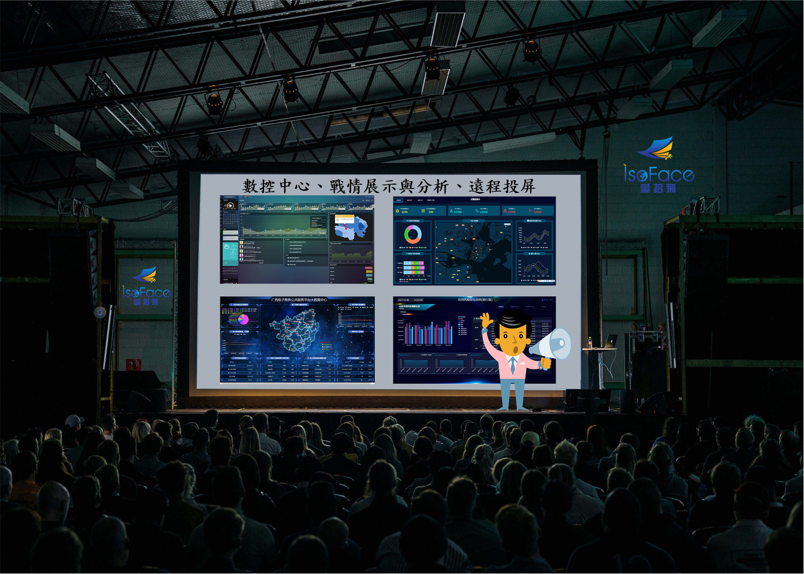
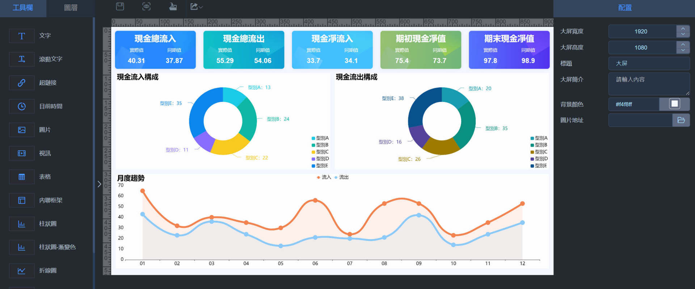
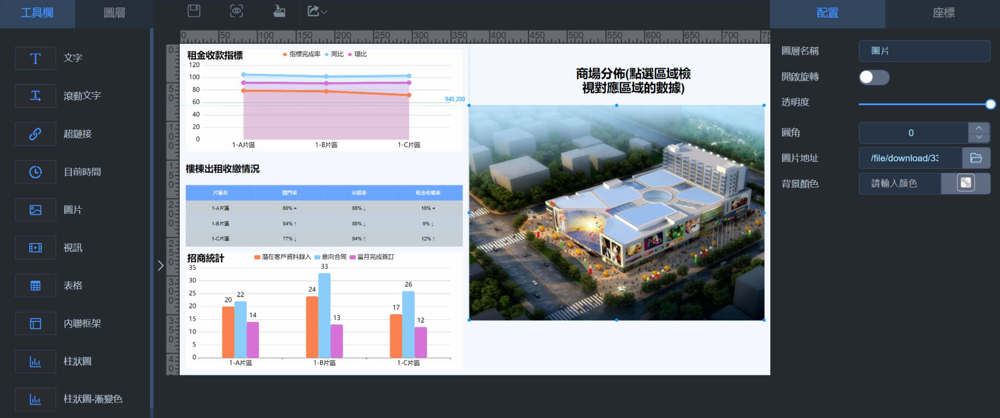
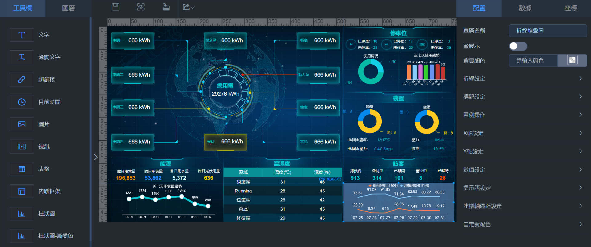
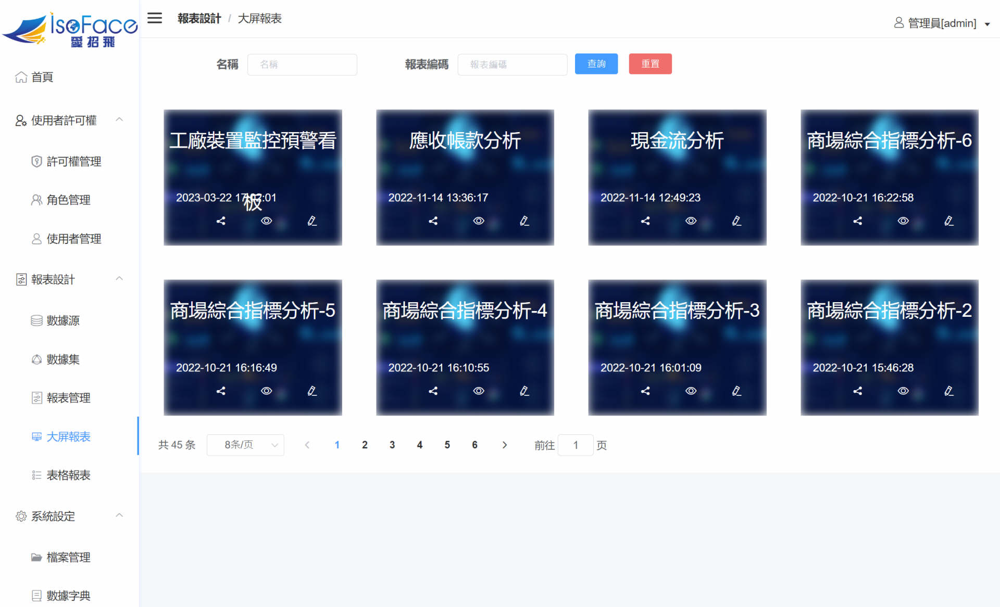

# 戰情室dashboard
整合多源資料與API呼叫，自訂企業風格，動態展示，將各部門零散數據資料統一展示。提供互動功能與警示燈號，企業管理績效一目瞭然，並可向下追蹤至相關明細頁面。戰情室是企業互動資訊平台，將企業重要指標一併呈現，也可用於會議簡報、IoT異常監控、數據電視牆展示。

> **加入 Facebook 社團**
>
> [https://www.facebook.com/groups/isoface/](https://www.facebook.com/groups/isoface/)
> 
> **點讚追蹤 Facebook 粉絲專頁**
> 
> [https://www.facebook.com/AIOT.ERP](https://www.facebook.com/AIOT.ERP)

戰情室聚焦商業智慧，運用統計分析技巧，解決企業營運分析的資料治理、資料應用等難題。商業智慧分析已經不再是空中樓閣虛擬般的存在，而是每個企業必須真正知已知彼了解的最佳工具，現在不用商業智慧分析，隨時可能被對手超越。

戰情室是一種數位顯示風格，將螢幕分割成多個區塊，在區塊間可將不同的應用程式放入顯示或使用，並且首創區塊間可通訊互動，發揮整合效能。常見作為統計圖表使用，可同時在畫面上顯示多個統計圖做比較，不只可選擇想要呈現的風格也可自行選擇想看的內容。戰情室的優勢，可自行選擇呈現風格，並依照權限可自行調整螢幕每個區塊內容，增加閱讀效率。

戰情室專為企業設計的智慧戰情中心，滿足豐富的場景需求，輕鬆實現多屏時代的資料視覺化智慧管理，輔助高效決策。

戰情室，快速整合多種資訊；可以跨平台並在不同瀏覽器運行，以直覺高互動方式呈現財務、營業、生產、品質、人資、物聯網等相關營運管理資訊，可搭配行動裝置，提供人機互動介面，協助企業在〝Anytime，Anywhere〞迅速作出正確且全面的管理決策。

戰情室提供高階戰情室、大螢幕電視牆、數位輪播看板系統，企業戰情室是專屬企業老闆及高階主管的互動資訊平台，將您企業或部門重要指標一併呈現，也可用於會議簡報、數據電視牆展示、IoT異常監控，主要運用場景如下：

## 炫酷的戰情室風格，體現科技感

內附圖表和元件，提供豐富的配置，為智慧園區、智慧城市、智慧工廠等打造精彩的圖表。

多種圖表與樣式，簡單設置即可實現輪播功能，隨時隨地查看戰情室中的圖表，掌握企業管理資料。可將戰情室頁面轉出至互動報表、定期報表、PDF檔案，供外出開會時使用。

## 跨平台與多種數據庫的資料源輕鬆整合，經營全貌清晰展現

整合多源資料與API呼叫，自訂企業風格，動態展示，將各部門零散數據資料統一展示。

透過互動功能與警示燈號，企業管理績效一目瞭然，並可向下追蹤至相關明細頁面。

適用於大螢幕電視牆、多螢幕拼接、資訊看版等裝置播放，支援遠地螢幕、資訊看版等裝置播放。

## 功能齊全的大屏設計組件庫

提供豐富且不斷完善的視覺化設計組件，使用者可以從組件欄裡自由選擇各類組件，拖拽到設計區進行頁面配置和佈局設計，同時還具有組件開放性支援能力。

## 使用低代碼與拖拽式自由設計佈局

幻燈片的播放效果，讓戰情室畫面自動循環輪播面。

拖拽式操作，多種圖表、元件、表格等組件支援任意擺放。

支援本地組件一鍵套用，大幅減少開發工作量。 

## 首創戰情室通訊互動整合
戰情室每個螢幕區塊，均可使用IsoBean微服務搭配 RestAPI快速組合應用。
使用 WebSocket 或其它通訊協定，戰情室各螢幕區塊可即時控制實務作業運行(ERP、MES、SACDA..)。

## 戰情系統二次開發功能，跨平台多設備端使用
戰情室在既有源碼的基礎，可任意擴充系統功能，在手機、平板、PC、大螢幕等多種裝置上展示。

## 靈活的商業智慧開發模式, 輕鬆調整儀表板佈局

多解析度自適應，在瀏覽器就能進行範本的佈局的調整，所見即所得。

應對邏輯複雜的模板，實現輕鬆除錯，減少模板錯誤風險。

內建多種經典佈局方案，支援手動調整模組大小，滿足個性化需求。

## 靈活的後臺使用權限管理，保證資料安全

擁有視覺化的管理後臺，支援管理員對用戶、團隊和公共資料來源的統一管理，同時可根據業務需要，進行大屏的管理，並為企業中的不同角色分配對應的視覺化大屏使用權限。

## 多種主題範本，自由定制樣式與風格

預置不同風格、不同類型的大屏範本，支援包括指揮中心、業務看板、彙報演示等業務場景。每個範本都是一個標準的風格包，用戶可以直接按需調用相應的範本進行更改，快速生成新的大屏頁面。

自主研發的戰情室，是採用Web流覽器，用於配置資料視覺化大屏的工具平臺。它提供了豐富的視覺化設計組件，通過簡單的點擊、拖拽等操作，即可進行圖表佈局的調整，只要幾分鐘就可以配置出一頁炫酷的視覺化大屏。依據用途可區分為以下三種︰

## 戰略型戰情室
用戶：通常是企業高層
用途：幫助高層管理者快速同步掌握、監控企業的運營情況（重要指標，例如營收、負債、利潤），並根據資料輔助制定經營決策。

## 分析型戰情室
用戶：通常是企業中層
用途：幫助中層人員透過數據分析，沿著資料的脈絡去尋找原因。比如銷售業績為什麼下降，應收帳款時間長的原因。重點在於分析，探究發生的原因。

## 操作型戰情室
用戶：通常是業務人員
用途：能夠持續、即時看到最新資訊，對資料的時效性要求高，用於監控每日進度和產出，以保證預期計劃和實際達成業績的相符，也就是保證戰略目標分解到每一天的完成度。

